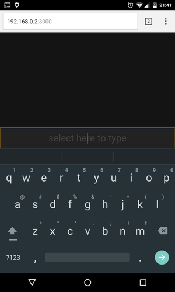

# Remote Control Server

Remote control your PC from your web browser on your other PC or mobile device.

Supports mouse movements, clicking and keyboard input.

Work in progress.



# install & run

Install from npm:

```bash
npm install -g remote-control-server
remote-control-server
```

or use from git source:

```bash
git clone https://github.com/jeremija/remote-control-server.git
cd node-mobile-remote
npm install
npm start
```

On your other machine or mobile device open the url:

```bash
http://192.168.0.10:3000
```

Replace `192.168.0.10` with the LAN IP address of your server.

# license

MIT
